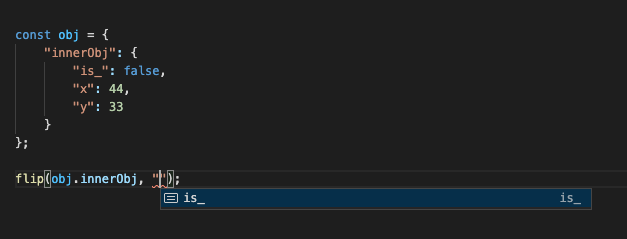

# flip

## Quick Example:

```typescript
const obj = {
    "is_": false
};

flip(obj, "is_");

//obj.is_ is now set to true
```

## In more detail:

When you have an object that contains another object that contains a boolean, and you wish to flip the value of that boolean for example, you would usually do as follows.

```typescript
const obj = {
    "innerObj": {
        "is_": false,
        "x": 44,
        "y": 33
    }
};

obj.innerObj.is_ = !obj.innerObj.is_;
```

With the `flip` function, the task will be a bit less tedious.

```typescript
flip(obj.innerObj, "is_");
```

The first argument is the object that contains the boolean value, and the second, is the key of the boolean property. Typescript will infer the key\(s\) of type boolean as illustrated below.



